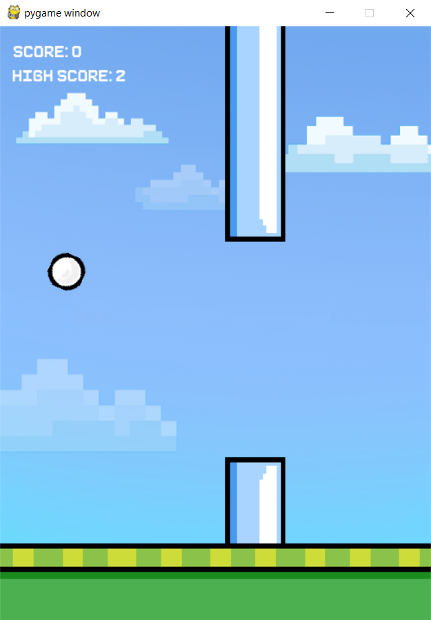
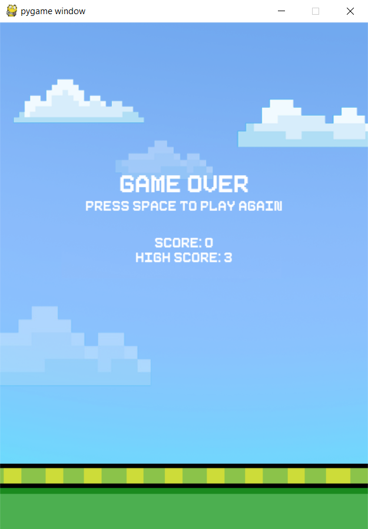

# Ball Jump
A simple, addictive game made using PyGame. Made during the summer after my first year in Computer Science. Heavily (heavily!!) influenced by Flappy Bird. All drawings are made by me using online pixel art makers, and Photoshop.

# Gameplay

To start the game, press SPACE, which triggers an initial ball jump. 
 Keep pressing the space bar to keep the ball in the air and avoid the pipes.
 Each pipe passed is 1 point! Hitting either the pipes, or the top or bottom of the screen, will cause the game to end.

## End screen

